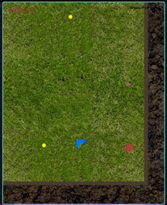

# My RPG Snake strategy in real time

### Here I will be documenting all the changes about how to write a full snake game with modern days graphics and features using raylib
___
## Patch 1

+ Textures for background and foreground
+ 2 types of fruits
+ Zoom in/out
+ Camera follows player but clamps to edges when near walls
+ Project is divided into smaller files
## Patch 2

+ Smoother update timing
+ Circles insted of squares
+ Snakes follows mouse pointer
+ No cells
+ Different color body parts
+ Render from tail to head e.g. head will be on top
## Patch 2

+ Sushi collectible that boosts a snake
+ Pizza collectible that cuts a tail in half
+ Move a snake with right/left keys. Space to boost
---
### **TODO**
- [x]~~image bg outside the map~~
- [x]~~find good grass texture png files~~
- different pickups:
    + [x]~~regular plus point~~
    + [x]~~bonus 10 point~~
    + [x]~~many items at once~~
    + [x]~~liited food (+ point, -tail)~~
    + [x]~~boosts the speed~~
    + make bonus food animated
- [x]~~make a head differen color and on top of a body~~
- [x]~~different color body parts~~
- [x]~~make a snake accelerate~~
- a dropoff location where you can cut your snake but get bonus points
- add sfx & music
- make walls and shoot points to burst them or enemies
- [x]~~split project structure into different files + headers~~
- add options to choose from 3-5 different snake swith different speed and maybe later stats
- animations
- textures for snake
- easings for snake tail and camera
- ~~diagonal movement~~
- ~~arrow on top of a player that will be registering move buttons and show the final directions where it will turn.~~
- [x]~~get rid off cells~~
- [x]~~circles instead of squares~~
- [x]~~move snake with a mouse pointer~~
- [x]~~control moves with left/right, movement is constant~~
- OR ~~limit the turn angle~~
- custom mouse pointer
- ~~make snake a dynamic array insted of static~~
- health system: if you are continiously colliding with a terrain or enemies, you start to shrink back and loose your health score and body mass, but not actual score. (more global damages will be presented later)
- if you spin in a circle, you gain the acceleration, after exiting it you gain a boost to your speed that decays